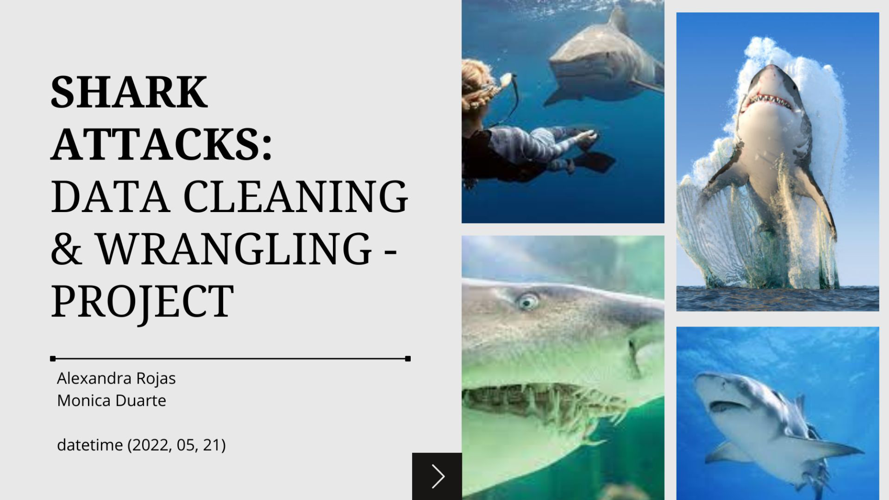

# Shark attacks in Teenagers
Project - Data cleaning &amp; wrangling \
Alexandra Rojas\
Monica Duarte\
21/05/2022\

# Data cleaning & data wrangling Project 🦈

This project focuses on cleaning and analyzing the global shark attack database (from the Global Shark Attack File's). 

For this, we have used python as programming language and Power BI as the tool for the final visualizations, applying data cleaning, wrangling and analysis techniques with pandas, matplotlib and  regex libraries.

# Hypothesis

For data cleaning and analysis, we looked for a hypothesis that could be demonstrated and validated through the available data. 

As the records gather demographic information on each attack, we examined a scenario centered on a social and age group that, because of the characteristics generally associated with their behavior, could make them easy targets for sharks:  teens. 

Taking into account the above arguments, the final hypothesis was:
"Teenagers are the demographic group most likely to be attacked by sharks".

# Index

💻 The `project 21_05_teenagers.ipynb` file contains the code for cleaning and analyzing the database.

📚 In the file `src.py` can be found the functions used for the cleaning of the data set.

👩‍🏫 In `Shark attacks.pdf` you can see the presentation made for the pitch of the project.    

# Visualizations

To see the visualizations created to understand the data and validate the hypothesis, you can access the link below: 

https://app.powerbi.com/view?r=eyJrIjoiZDY1ZGNmNGEtZjhkNS00NGMxLWFiNGYtZWNhNTU3N2EyODY5IiwidCI6IjM1ODlkOTA0LTdiOTAtNDQyMi1hOWNmLTM5YzZlNGJkMDYyYyIsImMiOjR9
